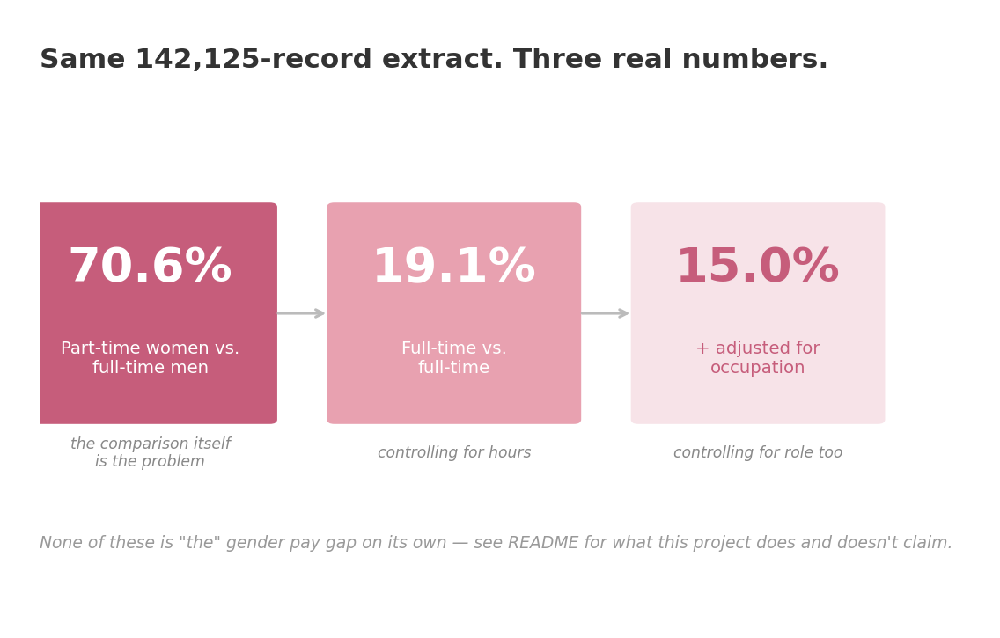

# Gender Pay Gap — Framing & Missing-Variable Bias

A follow-up to the shark-attack-risk-analysis project: same statistical
mistake (mistaking a raw observed count/gap for the full picture), a
different dataset, and a topic where the missing-context version of that
mistake actually gets published, not just hypothesized.

## What this is — and isn't

This project is about **how the same real wage data can be framed to
support very different headlines**, depending on which numbers you show
and which variables you control for. It is **not** an attempt to settle
whether the U.S. gender pay gap is "real," "explained," or evidence of
discrimination — that's a question of values as much as data, and a
student practice project isn't the place to adjudicate it. Any adjusted
number here is a demonstration of *method*, not a verdict.

## Data source

[IPUMS-CPS](https://cps.ipums.org/), Annual Social and Economic
Supplement (ASEC) 2025 — the U.S. Census Bureau's Current Population
Survey, harmonized and distributed by IPUMS. Real microdata, individual
respondent level, not simulated.

Variables extracted: `sex`, `incwage` (wage & salary income), `uhrsworkt`
(usual hours worked/week), `occ2010` (occupation), `educ` (educational
attainment), `ind1990` (industry), `age`, `empstat` (employment status),
plus IPUMS's standard identifier/weight columns.

**The raw extract is not included in this repo.** IPUMS requires each
user to register and pull their own copy rather than redistribute the
microdata file itself (see `.gitignore` — `data/raw/*.csv` is excluded
on purpose, not an oversight). To reproduce this analysis, register at
[cps.ipums.org](https://cps.ipums.org/), pull the same variables listed
above for ASEC 2025, and save it as `data/raw/ipums_cps_asec2025.csv`.
The **cleaned/derived** dataset in `data/clean/` — my own transformation
of that raw extract (filtered, recoded, with a computed hourly-wage
column) — is committed and shareable; it's not a copy of the original
file.

## The three numbers this project compares



1. **Part-time women vs. full-time men** — a deliberately unfair
   comparison. Of course full-time pay is higher than part-time pay,
   regardless of gender — the comparison itself is the problem, not
   anything about the people in it.
2. **Full-time vs. full-time** — the same comparison, fixed to compare
   people working comparable hours.
3. **+ adjusted for occupation** — grouped by occupation first, so it
   compares people doing comparable work, not the whole labor force at
   once.

On this extract (59,034 employed respondents, ASEC 2025, weighted by
`asecwt`):

| Comparison | Gap |
|---|---|
| Part-time women vs. full-time men | **70.6%** |
| Full-time vs. full-time | **19.1%** |
| + adjusted for occupation | **15.0%** |

All three come from the exact same 142,125-row extract. None is "the
truth" on its own. The manipulation isn't in inventing a number — it's
in which comparison you run and publish, and which one you leave out. A
raw gap without composition context is the same mistake as reading
shark-attack counts as individual risk without participation data.

## Cleaning

See [`cleaning.py`](cleaning.py):

- Restrict to employed respondents (`empstat` at-work codes)
- Drop IPUMS missing/NIU codes for `incwage` and `uhrsworkt` (documented
  in the IPUMS-CPS data dictionary, not invented)
- Derive an implied hourly wage (`incwage / (uhrsworkt × 52)`) so
  full-time and part-time respondents are compared like-for-like
  instead of on raw annual salary
- Drop duplicates

Three comparison functions, same input, different questions:
`mismatched_comparison_gap()` (part-time women vs. full-time men),
`full_time_gap()` (full-time vs. full-time), `adjusted_gap()`
(within a control column, e.g. occupation).

## Limitations

- ASEC is a survey with sampling weights (`asecwt`, person-level); all
  medians reported here use them via a custom weighted-median function
  (pandas has no built-in for this).
- "Adjusted for occupation" is still a single control. Real labor
  economics work on this question controls for far more (tenure, firm,
  negotiated vs. posted pay, etc.) and still debates how much of the
  residual gap reflects discrimination vs. unmeasured factors — this
  project doesn't resolve that, and doesn't claim to.
- Practice project, not a policy analysis.

## Running it

```bash
pip install -r requirements.txt
jupyter notebook pay_gap_analysis.ipynb
```

## Citation

Per [IPUMS CPS's citation policy](https://cps.ipums.org/cps/citation.shtml):

> IPUMS CPS, University of Minnesota, www.ipums.org.
>
> DOI: 10.18128/D030.V13.0 (2025)

Underlying source data are collected by the U.S. Census Bureau and
Bureau of Labor Statistics; IPUMS harmonizes and distributes them.
